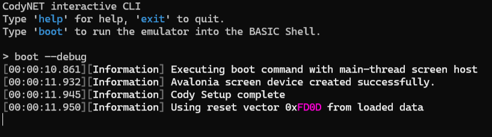
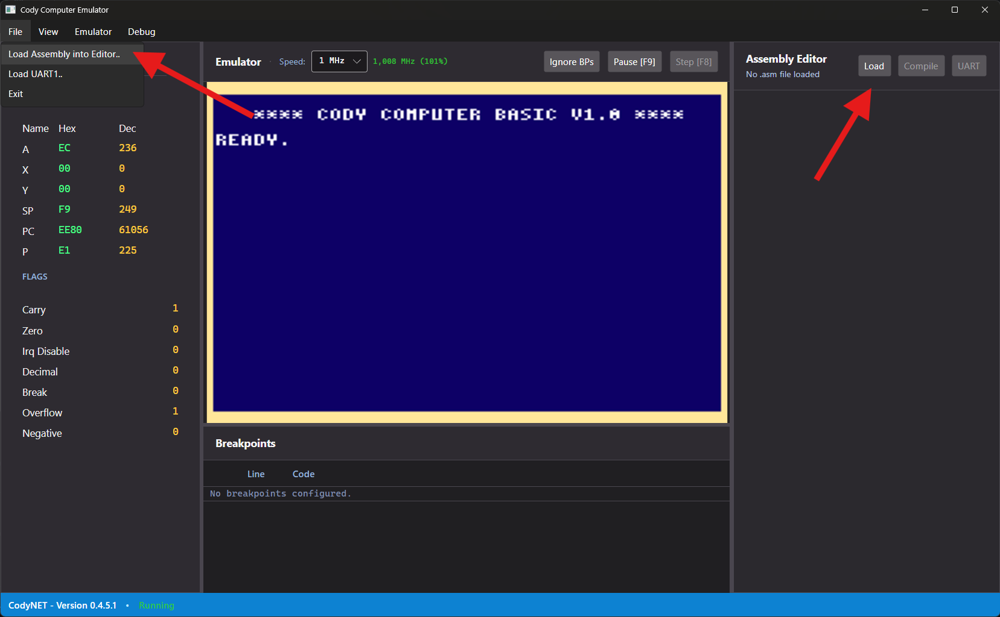
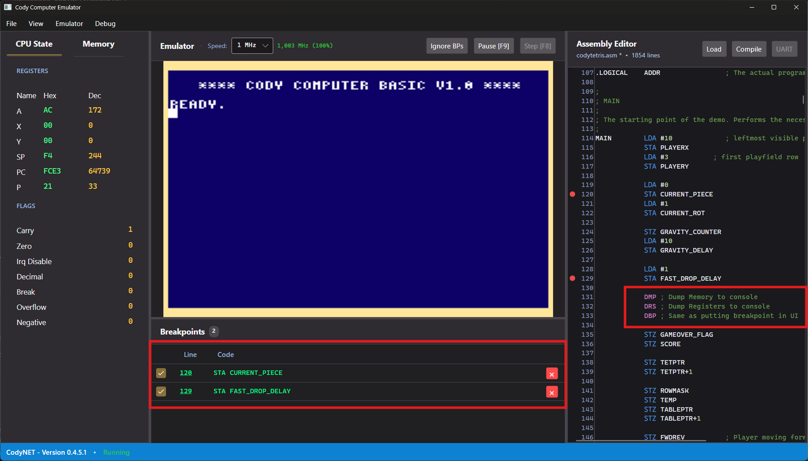
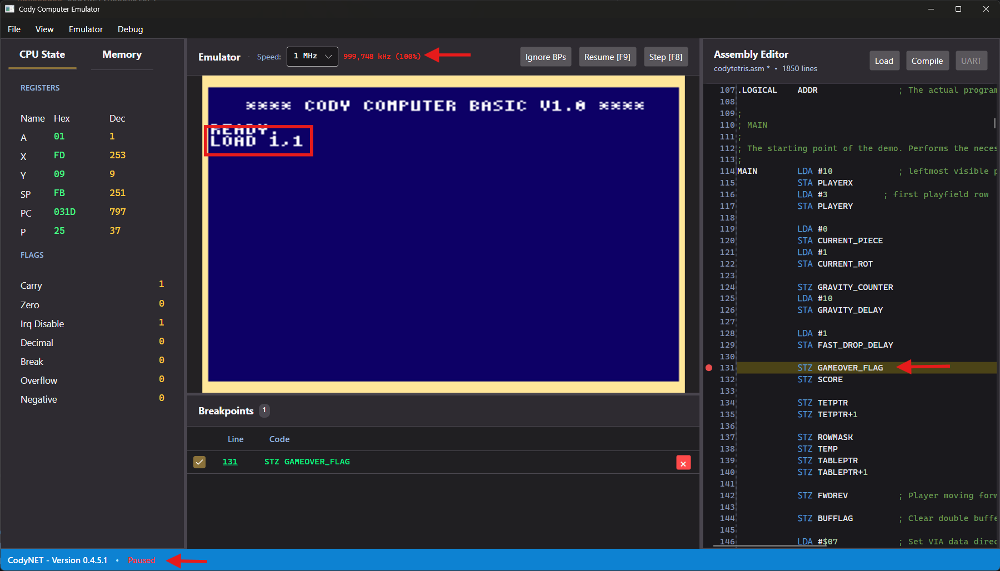

# CodyNET

CodyNET is a .NET-based emulator for the [Cody Computer](https://codycomputer.org), a retro-style computer built around the WDC65C02 microprocessor.

The project is based on ideas and behavior from [iTitus' Cody Emulator](https://github.com/iTitus/cody_emulator) and extends it with additional tooling such as debugging support and a .NET frontend.

## Quick start

Prerequisite: .NET SDK installed.

1. Download the [latest release](https://github.com/Mimonsi/CodyNET/releases/latest) for your platform and extract it.
2. Execute the file by double-clicking or via command line. When no parameters are provided, the program will launch an interactive shell. Enter `help` to list available commands
3. Enter `boot` to start the emulator with default parameters. Add the `--debug` parameter to start the integrated editor and other debugging tools.




## Usage

Inside the shell, use `help` to list commands.

## Using CodyNET IDE

When booting the emulator using the `boot`-command with the `--debug` flag, the integrated development environment (IDE) will launch alongside the emulator. The IDE provides tools for editing source code, inspecting memory, and debugging your programs.

To load an assembly source file (.asm) into the IDE, use the `File -> Load Assembly into Editor` menu button, or the `Load` button within the Assembly Editor window on the right.



The Assembly Editor will display the source code. From here, you can set breakpoints by clicking next to the line numbers (like in other IDEs). You can also edit the code in the editor.

Additional debug commands are available: 

### DBP
Breakpoint, same functionality as setting breakpoints in the UI

### DRS
Dumps all register values in the console/log

### DMP
Dumps the whole Cody Memore in the console/log



## Compiling and Testing
To test the code, click on "Compile" and then on "UART" to send the compiled binary to the emulator via UART.

Then, enter `LOAD 1,1` in Cody BASIC to load the binary file. Execution should start immediately.



In the screenshot you can see the program being loaded using `LOAD 1,1` and the breakpoint being hit immediately after. The emulation speed and bottom left status display turn red whenever the emulation is paused, either by hitting a breakpoint or by using the `pause` functionality.

## NOTE:
After changing breakpoints, the program needs to be re-compiled and uploaded. Use the `Emulator -> Reset CPU` menu button to reset CodyBASIC and upload and UART again.

## Loading programs

### BASIC over UART

Attach a BASIC (.bas) source file either:

- on startup with `--uart1-source <path>`
- in the frontend via `File -> Load UART1 Source`

Then load and run it in Cody BASIC:

```text
LOAD 1,0
RUN
```

### Binary over UART

Binary files (.bin) can also be attached via UART. In Cody BASIC, load them with:

```text
LOAD 1,1
```

Additional documentation:

- [CLI reference](./docs/CLI.md)
